This repo contains a compilation of projects I made during High school. Those projects are a little messy and there is french here and there but there you go :
- markov : A cli and gui markov chain implementation
- miamd : Miamd Is A Music Daemon
- engine : 3D engine with lua scripting
- ISNgame : 2D game(school group project)
- game : A mario clone
- pong : A pong clone
- conway : A conway's game of life implementation
- theshell : A shell
- WIPMod : A minecraft dimension mod
- shadowcasting : A shadowcasting 2D experiment

# markov :
The big text was found on the internet, the sentence next to "generate" was generated.
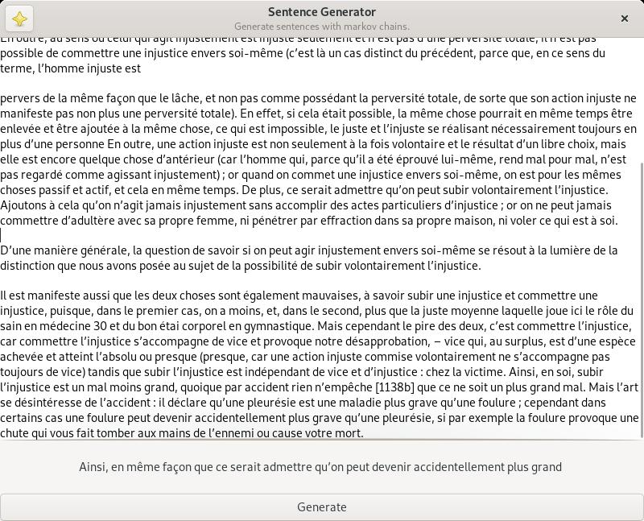

# WIPMod
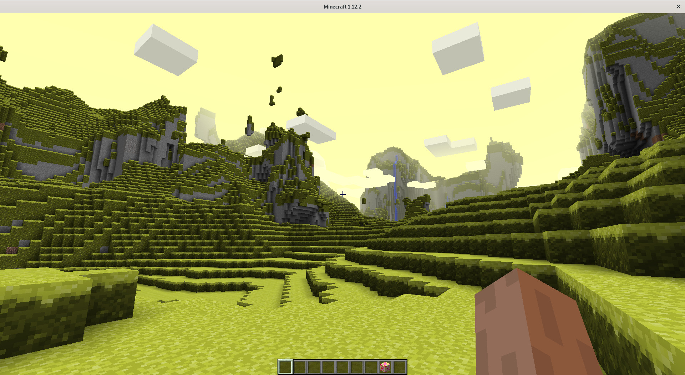
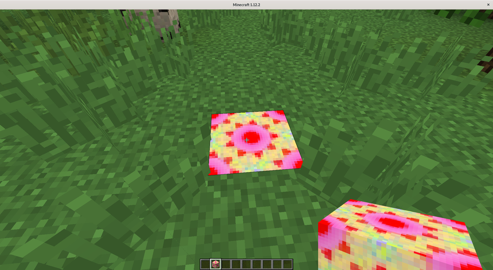

# theshell
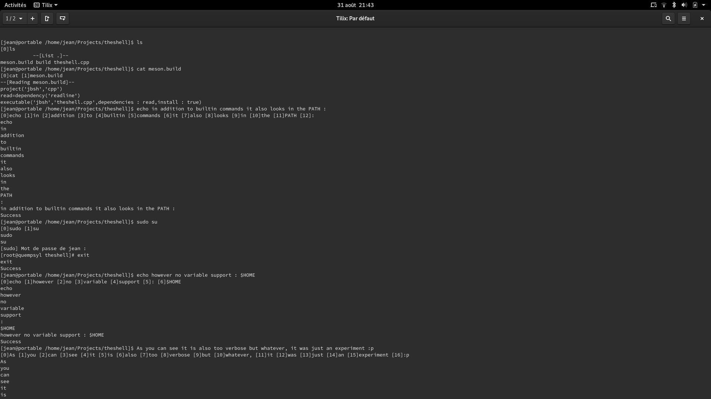

# ISNgame
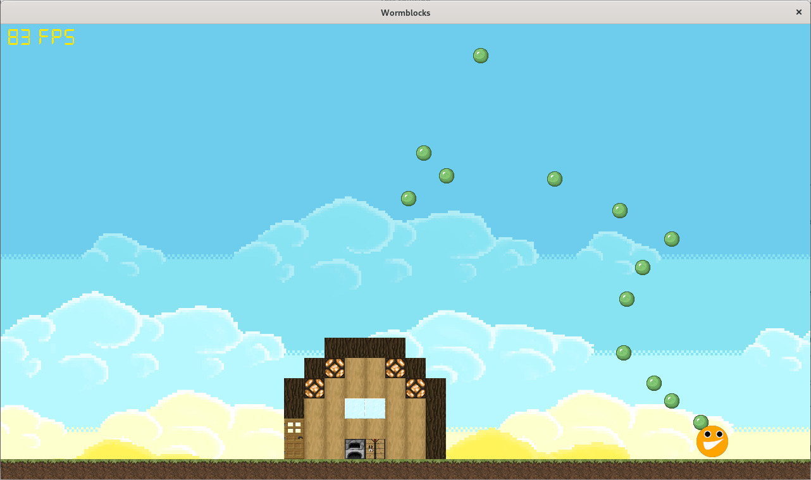
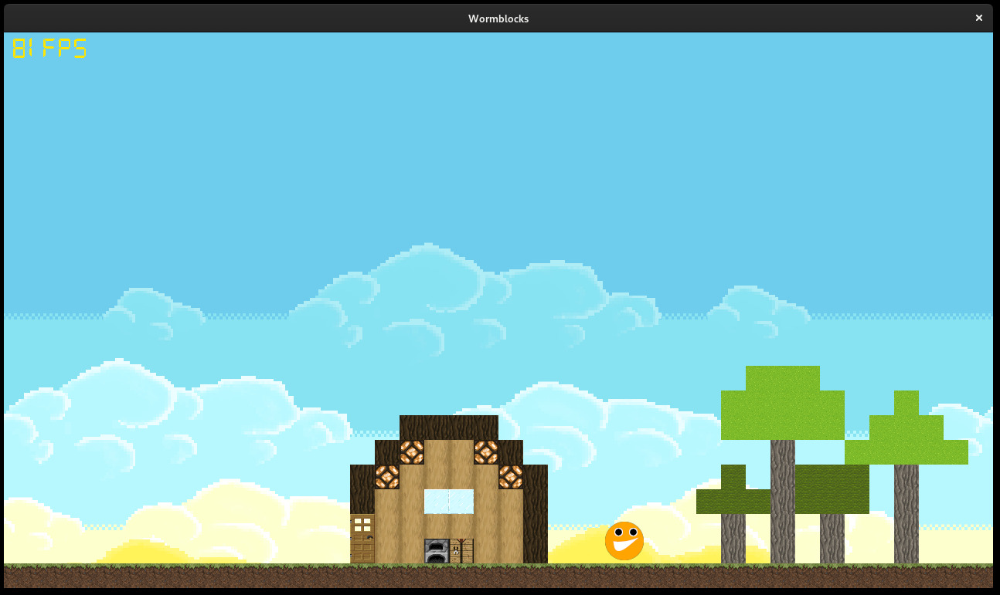
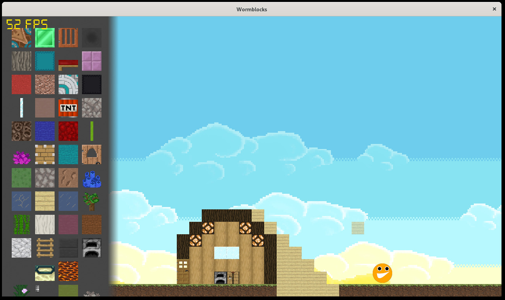

# game
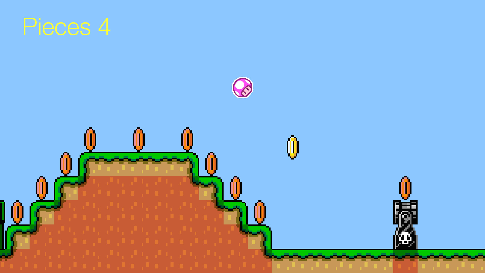
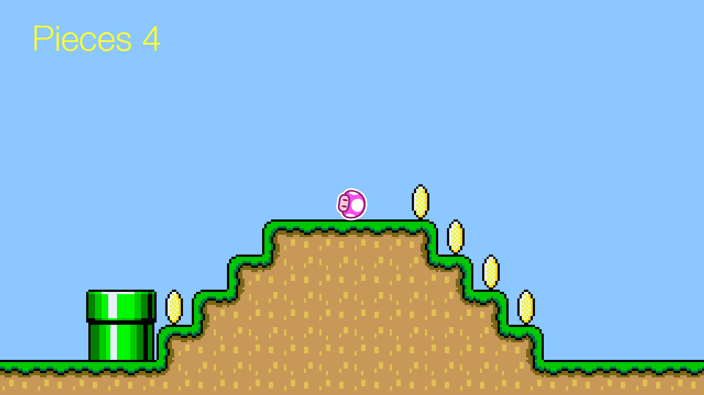

# conway
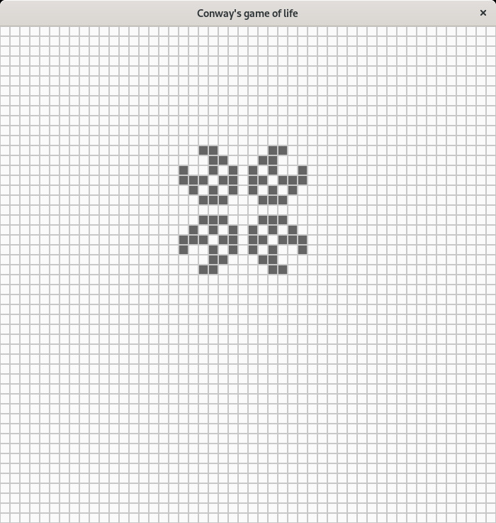

# pong
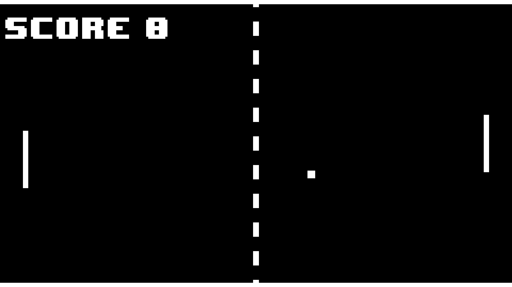

# shadowcasting
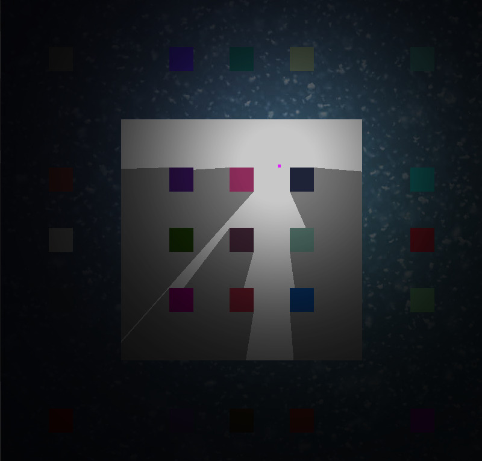

# engine
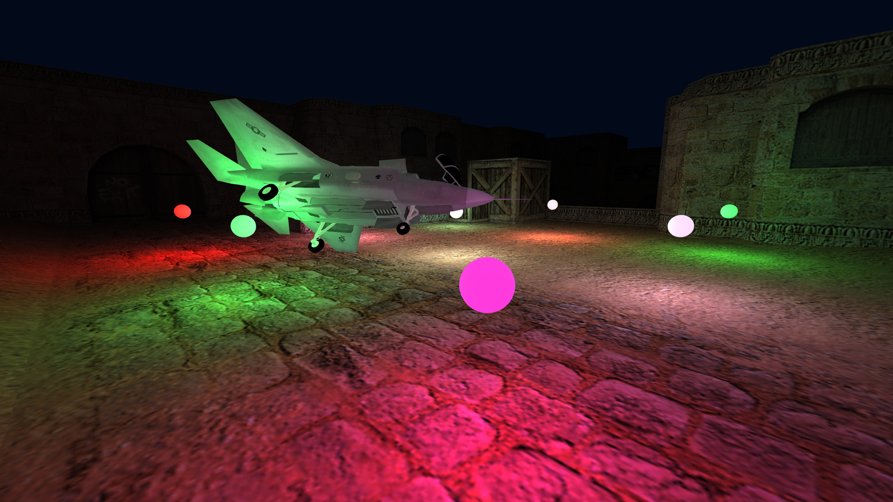
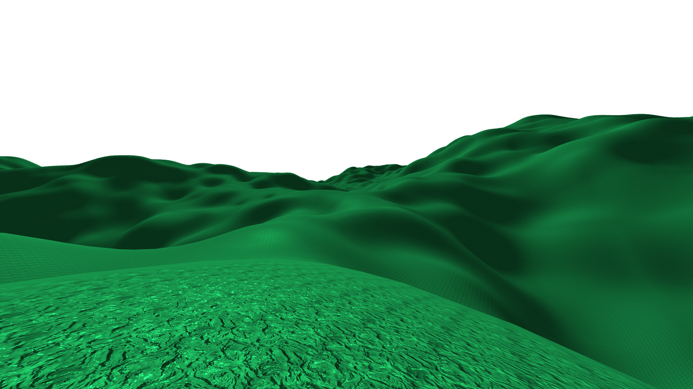
